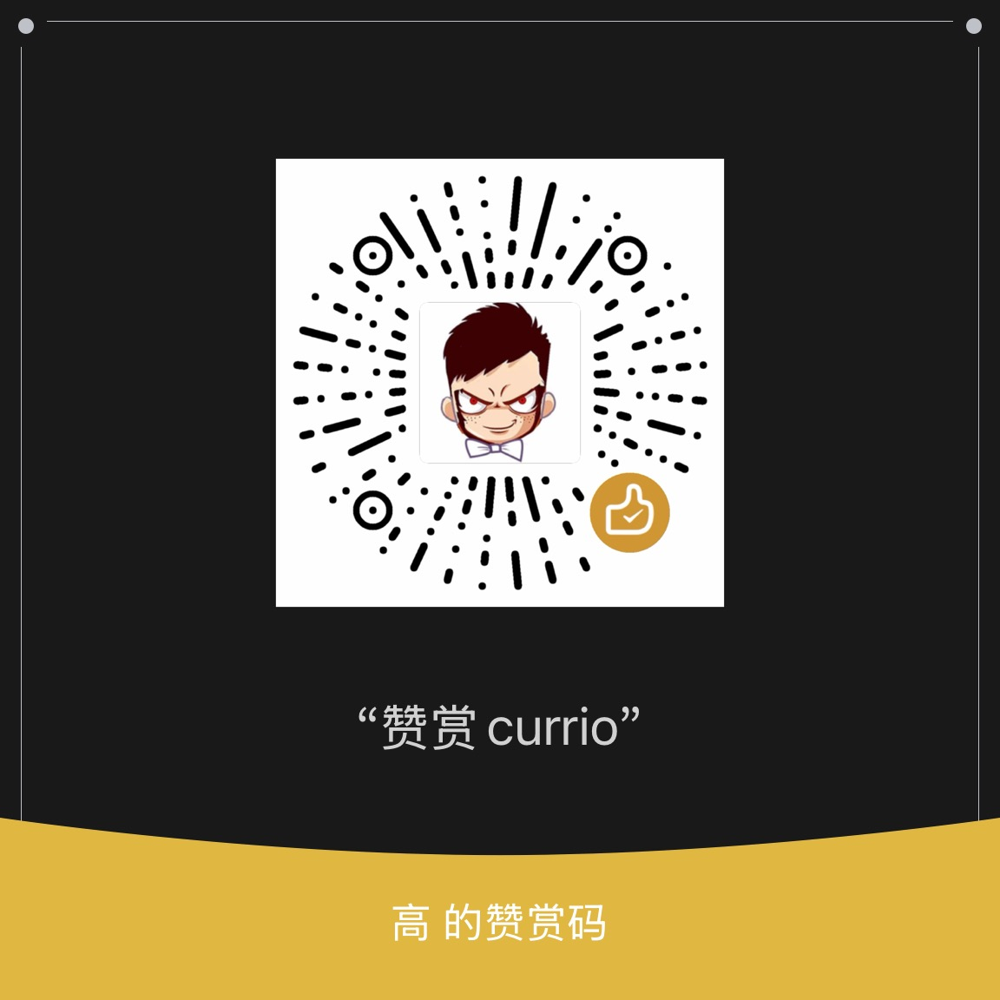

**[中文](README.zh-CN.md)** · **English**

**Currio** — A silent Chrome extension that auto-converts every currency on any webpage into your own, the moment the page loads.

>
> (Background: I built this so I wouldn't have to mentally convert foreign prices to CNY, and other things.)

## How It Works

```
You visit amazon.com → $1,299 → ¥9,429
```

No clicks, no copy-paste, no new tab. The conversion sits right beside the original price, barely noticeable until you need it.

## Features

- **Auto-Detect** — Recognizes `$100`, `¥1000`, `€50`, `£30`, `₩50000`, `USD 100`, `100 USD`, `NT$690`, `HK$100`, and more
- **Smart Inferrence** — `$` maps to 6+ currencies. Currio resolves it from page locale, browser language, TLD, and explicit currency codes
- **Always Fresh** — 45-min TTL rate cache, exponential backoff on failures, stale cache fallback
- **React-Proof** — Renders conversions via CSS `::after` pseudo-elements (no DOM mutation), so SPAs don't break
- **Zero Config** — Detects your preferred currency from browser language on first install
- **Site Blacklist** — One-click to disable on specific domains
- **Privacy First** — No tracking, no data collection, rate requests go directly to ExchangeRate-API
- **Lightweight** — ~50KB unpacked, < 3% page overhead, < 10MB memory

## Installation

### Chrome Web Store

*(Coming soon)*

### Manual (Developer Mode)

```bash
git clone https://github.com/gaojice/currio.git
```

1. Open `chrome://extensions`
2. Enable **Developer mode** (top right)
3. Click **Load unpacked** → select the `currio` folder


## Architecture

```
content.js (DOM scanner)
  ├── TreeWalker + MutationObserver
  ├── Multi-pattern regex matching
  ├── Locale-aware source inference
  └── CSS data-attribute rendering

background.js (Service Worker)
  ├── Exchange rate fetching
  ├── 45-min cache
  └── Message routing (settings + rates)

popup.js (Browser Action)
  ├── Currency picker
  └── Site blacklist manager
```

## Supported Currencies

| Symbol | Resolves To |
|--------|-------------|
| `$` | USD · CAD · AUD · HKD · SGD · TWD |
| `¥` / `￥` / `元` | JPY · CNY |
| `€` | EUR |
| `£` | GBP |
| `₩` | KRW |
| Multi-char | NT$ · HK$ · AU$ · CA$ · S$ · US$ |
| Codes | USD · EUR · GBP · JPY · CNY · TWD · KRW · AUD · CAD · HKD · SGD |

## Privacy

Currio reads **zero** personal data. The only outbound request is to `api.exchangerate-api.com` for exchange rates. No browsing history, no analytics, no telemetry.

## Roadmap

- [ ] Chrome Web Store publication
- [ ] Cryptocurrency support (BTC, ETH via CoinGecko)
- [ ] Optional IP-based geolocation for default currency
- [ ] Historical rate chart on hover

## License

MIT

---

<div align="center">
  <sub>
    Built with vanilla JS · Manifest V3 · exchange rates from <a href="https://exchangerate-api.com">ExchangeRate-API</a>
  </sub>
</div>

## Support

If you find Currio useful, consider buying me a coffee ☕


